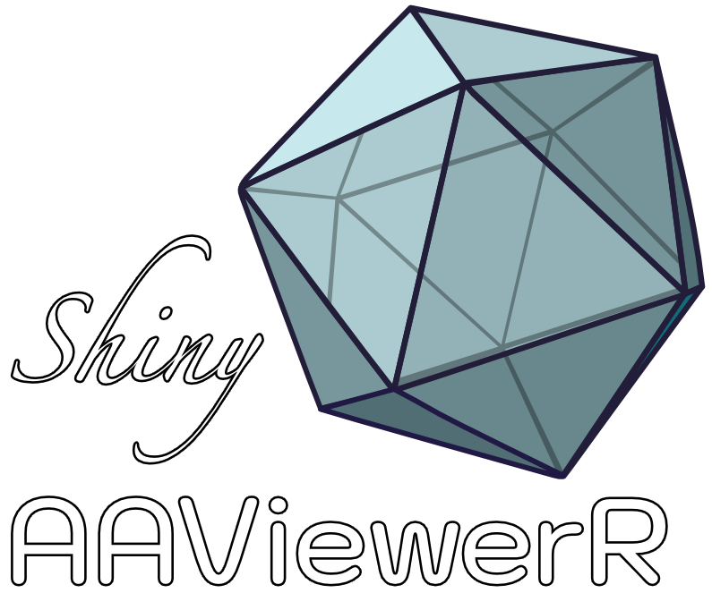

# **shinyAAVieweR** - Visualize AAV Insertion Fitness Maps in the web browser

## Description

This is an adaptation of **shinyNGLVieweR** developed by [Niels van der Velden](https://github.com/nvelden) to display AAV VP1 Domain Insertion Fitness maps. The UI is based on the [NGLVieweR](https://nvelden.github.io/NGLVieweR/) package, which is build on top of the [NGL.js](http://nglviewer.org/ngl/api/) JavaScript library. It can be used to visualize and interact with protein data bank (PDB) and structural files directly in the web browser.  

## Functionality

With the application it is possible to:

- Display the structure and surface in different representations
- Show the sequence and select residues to show on the structure
- Make custom selections and labels
- Animate the structure in spin and rotate mode
- Make snapshots 

## Usage

Load the 'app.R' file. Use the green 'Run App' button on the top right to run the app locally. To deploy, run: rsconnect::deployApp()
